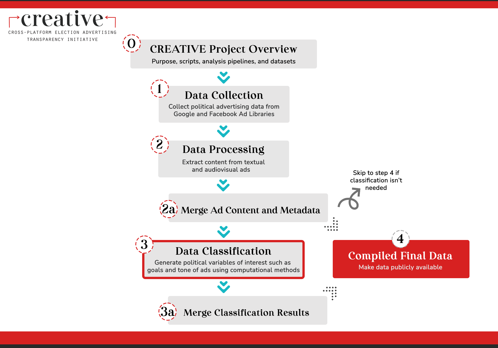
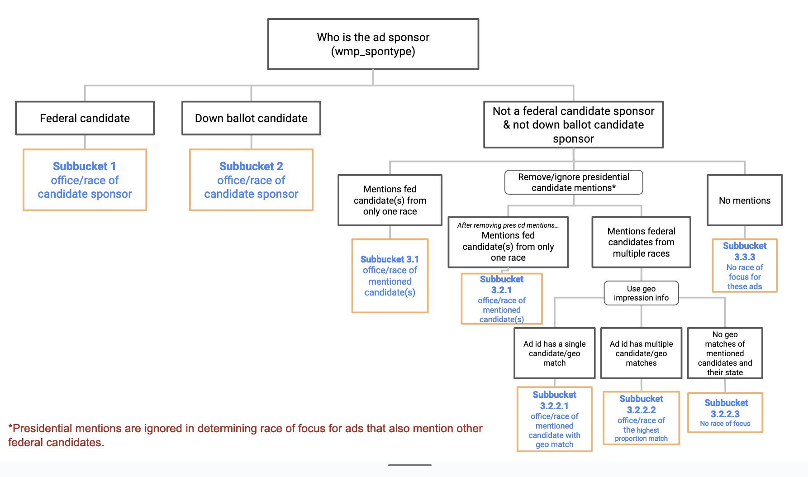

# CREATIVE --- Race of Focus

Welcome! This repo contains scripts for determining the electoral race an electoral ad is focused on.

This repo is a part of the [Cross-platform Election Advertising Transparency Initiative (CREATIVE)](https://www.creativewmp.com/). CREATIVE is an academic research project that has the goal of providing the public with analysis tools for more transparency of political ads across online platforms. In particular, CREATIVE provides cross-platform integration and standardization of political ads collected from Google and Facebook. CREATIVE is a joint project of the [Wesleyan Media Project (WMP)](https://mediaproject.wesleyan.edu/) and the [privacy-tech-lab](https://privacytechlab.org/) at [Wesleyan University](https://www.wesleyan.edu).

To analyze the different dimensions of political ad transparency we have developed an analysis pipeline. The scripts in this repo are part of the Data Classification step in our pipeline.



## Table of Contents

[1. Introduction](#1-introduction)  
[2. Data](#2-data)  
[3. Setup](#3-setup)  
[4. Directory Contents](#4-directory-contents)  
[5. Thank You!](#5-thank-you)

## 1. Introduction

This repo contains scripts for determining the electoral race an electoral ad is focused on based on which candidates are mentioned within it.

Specifically, this repo contains two R scripts for creating the 2022 datasets with each being based on different datasets:

- [`race_of_focus_fb_2022.R`](https://figshare.wesleyan.edu/account/articles/26093254) uses data from Facebook from 2022.
- [`race_of_focus_google_2022.R`](https://figshare.wesleyan.edu/account/articles/26124349) uses data from Google from 2022.

You can use the scripts in this repo to analyze ad data beyond the data we already analyzed. Check the Setup section for detailed instructions how to do so.

If you are only interested in data we have already analyzed, you can look at files present in the data folder. There are csv files and Rdata files with the oututs of race_of_focus scripts present there for Google 2020, Google 2022, Facebook 2020 (refered to as 140m) and Facebook 2022 data. There are three kinds of files present for each source: imageonly, textonly and general. 

For reference, whenever we reference the race of focus of a candidate, we are referencing the office for which that candidate is running. 

## 2. Data

The data created by the scripts in this repo is in Rdata and csv format. Each R scripts outputs two Rdata files and two csv format files. We give two versions to allow users to choose between the types of data that more general (csv) or more efficient for R (Rdata).

When determining which race an ad is focused on, we use different criteria based on the type of the sponsor of the ad (wmp_spontype). In general, we have three different groups of sponsors: federal candidate, down ballot candidate, and non-candidate group. For each type, we use a different decision-making for race of focus. For instance, for federal candidate and down ballot candidate ads, we simply take the office/race of the sponsor as race of focus. For non-candidate ads, we have a longer process which we visualize below. 

Once our race of focus classification is complete (output in the `race_of_focus` column), we then put these classification results into buckets and sub-buckets to help users categorize each ad into a group. This classification is represented as numbered indices (e.g. 1, 3.2.1) in the output column `sub_bucket`. 

The following diagram documents what each numbered sub-bucket represents and visualizes our decision-making process. For example, if an observation, i.e. an ad, is labeled sub-bucket 1 from our repo output, it represents an ad from a federal candidate race, and we make this decision because this ad was sponsored by a known federal candidate campaign. The variable `wmp_spontype` indicating whether an ad sponsor is a candidate campaign, national party, local party, or interest group can be found in one of our input files in the scripts. For an ad sponsored by a candidate's campaign, its race of focus is the candidate's race. For ads that were not sponsored by a candidate's campaign (e.g. by parties and outside groups instead), we determine the races of focus based on patterns of candidate mentions in the text fields and geolocations of targeted or exposed audiences (Presidential candidate mentions were removed to facilitate this process, because there were no presidential races in 2022. In the diagram, "pres cd" == "presidential candidate"). Using the `sub_bucket` indices, users can conveniently filter for ads relevant to the races of their interest for analysis. 



## 3. Setup

You can run the scripts in this repo in any order. Each R script in the repo acts on its own without calling the any other script due to each of these scripts using different datasets.

### 3.1 Install R and Packages

1. First, make sure you have R installed. While R can be run from the terminal, many people find it easier to use RStudio along with R. Here is a [tutorial for setting up R and RStudio](https://rstudio-education.github.io/hopr/starting.html). The script has been tried on and thus should run with no issues on R versions 4.2, 4.3 and 4.4. 

2. Next, make sure you have the following packages installed in R (the exact version we used of each package is listed in the [requirements_r.txt file](https://github.com/Wesleyan-Media-Project/race_of_focus/blob/main/requirements_r.txt). These are the versions we tested our scripts on. Thus, scripts might also work with other versions but we have not tested this). You can install by calling:

 ```R
   install.packages('purr')
   install.packages("stringr")
   install.packages("dplyr")
   install.packages("tidyr")
   install.packages("data.table")
   install.packages("R.utils")
   ```

### 3.2 Download Dataset Files

The R scripts that are in the repo reference data from existing ads we collected and processed. Depending on which platform (Google or Facebook) you are interested in, you may find the data we already collected to be sufficient. To download these files follow this link to [Figshare](https://www.creativewmp.com/data-access/). You will fill out a form and then immediately get data access.  

- `race_of_focus_fb_2022.R` uses data from Facebook from 2022, specifically the data labeled as `fb 2022 adid var 1` on our Figshare.
- `race_of_focus_google_2022.R` uses data from Google from 2022, specifically the data labeled as `g2022 adid var 1`  on our Figshare.

Legacy scripts for 2020 datasets, preserved here for internal use: 
- `race_of_focus_140m.R` uses data from Facebook from 2020.
- `race_of_focus_google_2020.R`(https://github.com/Wesleyan-Media-Project/datasets/blob/main/google/google_2020_adid_var1.csv.gz) uses data from Google from 2020. Note that this file is different from others listed above, as it is hosted on Github as opposed to on Figshare. 

However, if you wish to process your own ad data, this is also possible. To do so, you will want to change the name of your data to match the pre-existing files used in the script and ensure that you add a file path within the input files section of the scripts you are using that matches the file path found on your computer. In addition, if you are processing your own ad data, you will need to run [entity_linking](https://github.com/Wesleyan-Media-Project/entity_linking_2022) and put it as the path to path_el_results to make path_el_results correct.

If you are using data from existing ads we collected and processed, then you can use the R scripts from this repo. Ensure that you modify the file path within the input files section of the scripts you are using so that they match up with what is found on your computer.

Given that you are using data from existing ads we collected and processed, keep in mind that there is no correct order for the R scripts in this repo to be ran. Each R script is ran independently and is based on different data.

You can find the exact files needed for each script by looking at the code in the R script that you are running and specifically at what is under #Input files. For example, `path_140m_vars <- "../fb_2020/fb_2020_140m_adid_var1.csv.gz"` means that you need the file `fb_2020_140m_adid_var1.csv.gz`.

Some of the files needed are not actually in the GitHub directories due to being too large. Instead, these are available on Figshare. These include the files that are used in the first line of code after #Input Files.

Here are dependency repos or steps you will need to follow before running this repo. The outputs from these scripts are used as input files in race of focus scripts.

Running the two main scripts for 2022 datasets `race_of_focus_fb_2022.R` and `race_of_focus_google_2022.R` requires output or datasets from:

- [`merge_preprocessed_results`](https://github.com/Wesleyan-Media-Project/data-post-production/tree/main/01-merge-results/01_merge_preprocessed_results) step in `data-post-production`
- [`entity_linking_2022`](https://github.com/Wesleyan-Media-Project/entity_linking_2022)
- [`datasets`](https://github.com/Wesleyan-Media-Project/datasets)

Legacy scripts that were not used for creating 2022 datasets (scripts for creating 2020 datasets), preserved here for internal use: 
- `race_of_focus_140m.R`
- `race_of_focus_google_2020.R`


### 3.3 Run R Scripts

You should now be able to run the script. By default, the script uses both candidate mentions and appearances. For mentions only, change the line within each script that is reading `textonly <- F` to `textonly <- T` in the repos `race_of_focus_fb_2022.R` and `race_of_focus_google_2022.R`. We provide this option to allow users to decide on race of focus using the text mentions or visual appearances of candidates .

Running the scripts through the terminal would look like this

```bash
cd race_of_focus_fb_2022.R
Rscript arace_of_focus_fb_2022.R
```

and can also alternatively be done through the RStudio interface.

Running the `race_of_focus_fb_2022.R` script took around 20 minutes on a M2 Macbook, for reference.

## 4. Directory Contents 
* `data` : Folder containing 17 files of data, including `data/pdids_for_which_race_of_focus_is_NA_2020.txt`, a file which contains the pdids, or entity level identifiers for which the race_of_focus is not available in 2020 data, as well as race_of_focus classifications in .csv and .rdata formats with separate files for all mentions, image_only and text_only appearences of candidates for Facebook 2020, Facebook 2022, Google 2020 and Google 2022 data. 
* `race_of_focus_140m.R` : Legacy script for determining the electoral race an electoral ad is focused on based on which candidates are mentioned within it for 140m dataset, preserved here for internal use.
* `race_of_focus_fb_2022.R` : Script for determining the electoral race an electoral ad is focused on based on which candidates are mentioned within it for fb_2022 dataset.
* `race_of_focus_google_2020.R` : Legacy script for determining the electoral race an electoral ad is focused on based on which candidates are mentioned within it for google_2020 dataset, preserved here for internal use.
* `race_of_focus_google_2022.R` : Script for determining the electoral race an electoral ad is focused on based on which candidates are mentioned within it for google_2022 dataset. 
## 5. Thank You

<p align="center"><strong>We would like to thank our supporters!</strong></p><br>

<p align="center">This material is based upon work supported by the National Science Foundation under Grant Numbers 2235006, 2235007, and 2235008.</p>

<p align="center" style="display: flex; justify-content: center; align-items: center;">
  <a href="https://www.nsf.gov/awardsearch/showAward?AWD_ID=2235006">
    
  </a>
</p>

<p align="center">The Cross-Platform Election Advertising Transparency Initiative (CREATIVE) is a joint infrastructure project of the Wesleyan Media Project and privacy-tech-lab at Wesleyan University in Connecticut.

<p align="center" style="display: flex; justify-content: center; align-items: center;">
  <a href="https://www.creativewmp.com/">
    
  </a>
</p>

<p align="center" style="display: flex; justify-content: center; align-items: center;">
  <a href="https://mediaproject.wesleyan.edu/">
    
  </a>
</p>

<p align="center" style="display: flex; justify-content: center; align-items: center;">
  <a href="https://privacytechlab.org/" style="margin-right: 20px;">
    
  </a>
</p>
